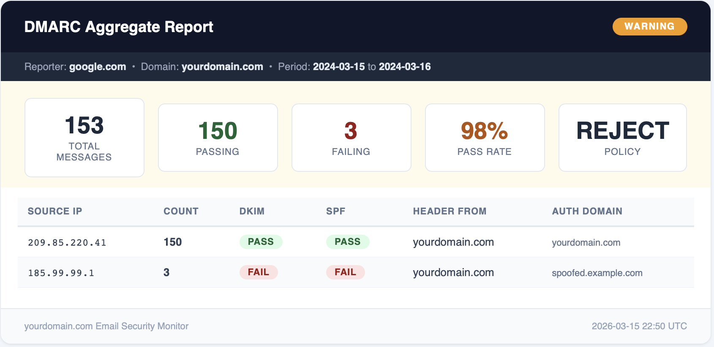

# EmailReports

[](https://github.com/mgieselman/EmailReports/actions/workflows/ci.yml)
[](https://github.com/mgieselman/EmailReports/actions/workflows/deploy.yml)
[](https://codecov.io/gh/mgieselman/EmailReports)
[](https://www.python.org/downloads/)
[](https://github.com/astral-sh/ruff)
[](https://opensource.org/licenses/MIT)

Low-cost Azure Function that processes DMARC aggregate (RUA) and TLS-RPT reports from a Microsoft 365 shared mailbox and sends alerts to Teams and email.



Built for **small organizations (<200 users)** that want automated email security monitoring without the cost of a commercial DMARC service. Runs on the Azure Functions Consumption plan — effectively free for most tenants.

## What it does

1. Timer fires every 30 minutes (configurable)
2. Reads unread messages from a shared M365 mailbox via Microsoft Graph API
3. Routes messages by recipient alias (DMARC vs TLS-RPT)
4. Extracts and parses attachments (.xml, .xml.gz, .zip for DMARC; .json, .json.gz, .zip for TLS-RPT)
5. Calculates severity: **info** (all passing), **warning** (some failures), **critical** (>10% failure rate)
6. Posts Adaptive Cards to a Teams channel via webhook
7. Optionally sends HTML dashboard-style emails via Graph sendMail
8. Marks all processed messages as read

## Architecture

```
                    ┌─────────────────┐
  Reporting MTAs    │  Shared Mailbox  │
  (Google, MSFT,    │  emailreports@   │
   Yahoo, etc.)     │  yourdomain.com  │
        │           └────────┬─────────┘
        │  DMARC/TLS-RPT         │
        │  reports via email      │ Microsoft Graph API
        ▼                         ▼
                          ┌──────────────┐
                          │ Azure Func   │  Timer trigger
                          │ (Python 3.12)│  every 30 min
                          └──────┬───────┘
                                 │
                    ┌────────────┼────────────┐
                    ▼            ▼             ▼
              ┌──────────┐ ┌──────────┐ ┌──────────┐
              │  Teams   │ │  Email   │ │ Mark as  │
              │  Webhook │ │  Alert   │ │  Read    │
              └──────────┘ └──────────┘ └──────────┘
```

## Quick Start

### Prerequisites

- Azure subscription (Consumption plan, ~$0/mo for this workload)
- Microsoft 365 tenant
- Python 3.12
- Azure CLI (`az`) and Azure Functions Core Tools (`func`)

### 1. Create the shared mailbox

In Exchange Admin Center, create a shared mailbox (e.g., `emailreports@yourdomain.com`) with aliases for:
- `dmarc-reports@yourdomain.com`
- `tls-reports@yourdomain.com`

### 2. Configure DNS records

```
# DMARC — adjust p= policy to your needs (none → quarantine → reject)
_dmarc.yourdomain.com  TXT  "v=DMARC1; p=reject; rua=mailto:dmarc-reports@yourdomain.com; adkim=s; aspf=s"

# TLS-RPT
_smtp._tls.yourdomain.com  TXT  "v=TLSRPTv1; rua=mailto:tls-reports@yourdomain.com"
```

### 3. Create the Entra ID app registration

```bash
# Create the app
az ad app create --display-name "EmailReports" --sign-in-audience "AzureADMyOrg"

# Note the appId from the output, then add Graph permissions
APP_ID="<your-app-id>"
GRAPH="00000003-0000-0000-c000-000000000000"

az ad app permission add --id $APP_ID --api $GRAPH --api-permissions "810c84a8-4a9e-49e6-bf7d-12d183f40d01=Role"  # Mail.Read
az ad app permission add --id $APP_ID --api $GRAPH --api-permissions "e2a3a72e-5f79-4c64-b1b1-878b674786c9=Role"  # Mail.ReadWrite
az ad app permission add --id $APP_ID --api $GRAPH --api-permissions "b633e1c5-b582-4048-a93e-9f11b44c7e96=Role"  # Mail.Send (optional, for email alerts)

# Grant admin consent
az ad app permission admin-consent --id $APP_ID

# Create a client secret (1 year expiry)
az ad app credential reset --id $APP_ID --append --display-name "func-emailreports" --years 1
```

#### Scope permissions to the shared mailbox only (recommended)

By default, `Mail.Read` grants access to all mailboxes in your tenant. Use an Exchange application access policy to restrict it:

```powershell
Connect-ExchangeOnline

# Create a mail-enabled security group containing only the shared mailbox,
# then restrict the app to that group
New-ApplicationAccessPolicy `
  -AppId "<your-app-id>" `
  -PolicyScopeGroupId "emailreports-security-group@yourdomain.com" `
  -AccessRight RestrictAccess `
  -Description "Restrict EmailReports to shared mailbox only"
```

### 4. Deploy Azure resources

```bash
# Resource group
az group create --name rg-emailreports --location <your-region>

# Storage account
az storage account create --name stemailreports --resource-group rg-emailreports --sku Standard_LRS

# Function App
az functionapp create \
  --name func-emailreports \
  --resource-group rg-emailreports \
  --storage-account stemailreports \
  --consumption-plan-location <your-region> \
  --runtime python \
  --runtime-version 3.12 \
  --functions-version 4 \
  --os-type Linux

# Key Vault (store client secret here, not in app settings)
az keyvault create --name kv-emailreports --resource-group rg-emailreports

# Enable managed identity and grant it Key Vault access
PRINCIPAL_ID=$(az functionapp identity assign --name func-emailreports --resource-group rg-emailreports --query principalId -o tsv)

az role assignment create \
  --role "Key Vault Secrets User" \
  --assignee-object-id $PRINCIPAL_ID \
  --assignee-principal-type ServicePrincipal \
  --scope $(az keyvault show --name kv-emailreports --query id -o tsv)

# Store the client secret
az keyvault secret set --vault-name kv-emailreports --name AzureClientSecret --value "<your-client-secret>"

# Configure app settings
az functionapp config appsettings set --name func-emailreports --resource-group rg-emailreports --settings \
  "AZURE_TENANT_ID=<your-tenant-id>" \
  "AZURE_CLIENT_ID=<your-app-id>" \
  "AZURE_CLIENT_SECRET=@Microsoft.KeyVault(SecretUri=https://kv-emailreports.vault.azure.net/secrets/AzureClientSecret/)" \
  "REPORT_MAILBOX=emailreports@yourdomain.com" \
  "MAIL_FOLDER=" \
  "DMARC_ALIAS=dmarc-reports@yourdomain.com" \
  "TLSRPT_ALIAS=tls-reports@yourdomain.com" \
  "TEAMS_WEBHOOK_URL=" \
  "GENERIC_WEBHOOK_URL=" \
  "ALERT_EMAIL_ENABLED=false" \
  "ALERT_EMAIL_FROM=emailreports@yourdomain.com" \
  "ALERT_EMAIL_TO=admin@yourdomain.com" \
  "DELETE_AFTER_DAYS=-1" \
  "MOVE_PROCESSED_TO=" \
  "TIMER_SCHEDULE_CRON=0 */30 * * * *"
```

### 5. Deploy the code

**Option A: GitHub Actions (recommended)**

1. Fork this repo
2. Get the publish profile:
   ```bash
   az functionapp deployment list-publishing-profiles --name func-emailreports --resource-group rg-emailreports --xml
   ```
3. Add it as a GitHub secret named `AZURE_FUNCTIONAPP_PUBLISH_PROFILE`
4. Update `app-name` in `.github/workflows/deploy.yml` to match your Function App name
5. Push to `main` — CI runs tests, then deploys automatically

**Option B: Manual deploy**

```bash
func azure functionapp publish func-emailreports
```

### 6. Create the Teams webhook

1. In Teams, right-click the target channel
2. Select **Workflows** > **Post to a channel when a webhook request is received**
3. Copy the webhook URL into your `TEAMS_WEBHOOK_URL` app setting

## Configuration Reference

| Variable | Required | Description |
|----------|----------|-------------|
| `AZURE_TENANT_ID` | Yes | Entra tenant ID |
| `AZURE_CLIENT_ID` | Yes | App registration client ID |
| `AZURE_CLIENT_SECRET` | Yes | Client secret (use Key Vault reference) |
| `REPORT_MAILBOX` | Yes | Shared mailbox address |
| `MAIL_FOLDER` | No | Folder name to read from (blank = Inbox) |
| `DMARC_ALIAS` | Yes | Alias that receives DMARC reports |
| `TLSRPT_ALIAS` | Yes | Alias that receives TLS-RPT reports |
| `TEAMS_WEBHOOK_URL` | No | Teams incoming webhook URL (blank to disable) |
| `GENERIC_WEBHOOK_URL` | No | HTTP POST endpoint for any webhook (Slack, Discord, n8n, etc.) |
| `ALERT_EMAIL_ENABLED` | No | Set to `true` to enable email alerts |
| `ALERT_EMAIL_FROM` | No | Sender address for email alerts |
| `ALERT_EMAIL_TO` | No | Recipient address for email alerts |
| `DELETE_AFTER_DAYS` | No | Delete read messages after N days (`0` = immediate, `-1` = never) |
| `MOVE_PROCESSED_TO` | No | Move processed messages to this folder (ignored if deleting immediately) |
| `TIMER_SCHEDULE_CRON` | No | NCRONTAB schedule (default: `0 */30 * * * *`) |

## Local Development

```bash
cp local.settings.json.example local.settings.json
# Fill in your values

python3.12 -m venv .venv
source .venv/bin/activate
pip install -r requirements.txt

# Run the function locally
func start

# Run tests
pip install pytest pytest-cov
pytest tests/ --cov --cov-report=term-missing

# Send a test alert email with sample data
python test_alert.py --email
```

## Project Structure

```
├── function_app.py              # Timer trigger, orchestration, message routing
├── graph_client.py              # MSAL auth + Graph API (messages, attachments, sendMail)
├── dmarc_parser.py              # Parse DMARC RUA XML from .xml/.gz/.zip
├── tlsrpt_parser.py             # Parse TLS-RPT JSON from .json/.gz/.zip
├── alert.py                     # Severity calculation, HTML dashboard, Teams cards
├── models.py                    # Dataclasses: DmarcReport, TlsRptReport, AlertSummary
├── test_alert.py                # Manual test script for sending sample alerts
├── tests/                       # 141 tests, 100% coverage
│   ├── fixtures/                # Sample DMARC XML and TLS-RPT JSON
│   ├── test_models.py
│   ├── test_dmarc_parser.py
│   ├── test_tlsrpt_parser.py
│   ├── test_graph_client.py
│   ├── test_alert.py
│   └── test_function_app.py
├── .github/workflows/
│   ├── ci.yml                   # Tests on every push/PR
│   └── deploy.yml               # Tests + deploy on push to main
├── host.json
├── requirements.txt
├── local.settings.json.example
└── .coveragerc
```

## Monitoring

The function has three layers of failure detection, from fastest to most comprehensive:

### 1. In-code error notifications (instant)

If the function throws an unhandled exception, it catches the error and sends a **CRITICAL** alert with the traceback to your configured Teams webhook and/or generic webhook before re-raising. This gives you immediate visibility without needing to check the Azure Portal.

### 2. Azure Monitor metric alerts (within minutes)

Two alert rules notify you via email when something is wrong:

| Alert | Condition | Check interval | What it means |
|-------|-----------|----------------|---------------|
| **Http5xx** | Any 5xx error in a 5-minute window | Every 5 min | Function crashed or threw an unhandled exception |
| **No Executions** | Zero function executions in 1 hour | Every 30 min | Timer stopped firing — function app may be stopped, frozen, or misconfigured |

To set these up in your own deployment:

```bash
# Create an action group (who gets notified)
az monitor action-group create \
  --name "emailreports-alerts" \
  --resource-group rg-emailreports \
  --short-name "EmailRpts" \
  --action email admin admin@yourdomain.com

SCOPE="/subscriptions/<sub-id>/resourceGroups/rg-emailreports/providers/Microsoft.Web/sites/func-emailreports"
ACTION_GROUP="/subscriptions/<sub-id>/resourceGroups/rg-emailreports/providers/microsoft.insights/actionGroups/emailreports-alerts"

# Alert on any function errors
az monitor metrics alert create \
  --name "EmailReports-Http5xx" \
  --resource-group rg-emailreports \
  --scopes "$SCOPE" \
  --condition "total Http5xx > 0" \
  --window-size 5m \
  --evaluation-frequency 5m \
  --severity 2 \
  --action "$ACTION_GROUP" \
  --description "Function execution errors"

# Alert if function stops running entirely
az monitor metrics alert create \
  --name "EmailReports-No-Executions" \
  --resource-group rg-emailreports \
  --scopes "$SCOPE" \
  --condition "total FunctionExecutionCount < 1" \
  --window-size 1h \
  --evaluation-frequency 30m \
  --severity 2 \
  --action "$ACTION_GROUP" \
  --description "Function has not executed in over 1 hour"
```

### 3. Application Insights (full history)

All logs, exceptions, and traces are stored in App Insights automatically. Useful queries in the Azure Portal **Logs** blade:

```kusto
// Recent failures
requests
| where success == false
| order by timestamp desc
| take 20

// All function runs in the last 24 hours
requests
| where timestamp > ago(24h)
| summarize count() by bin(timestamp, 30m), success
| render timechart

// Exceptions with full stack traces
exceptions
| order by timestamp desc
| take 10
```

## Alert Examples

Email alerts use a dashboard layout with:
- Dark header bar with severity badge (ALL CLEAR / WARNING / CRITICAL)
- KPI stat cards (total messages, pass/fail counts, pass rate)
- Color-coded PASS/FAIL pill badges per record
- Detailed results table

Teams alerts use Adaptive Cards with the same severity and data in markdown format.

## Contributing

1. Fork the repo
2. Create a feature branch
3. Ensure tests pass: `pytest tests/ --cov -W error::DeprecationWarning`
4. Coverage must stay at 100%
5. Open a PR against `main`

## License

MIT
