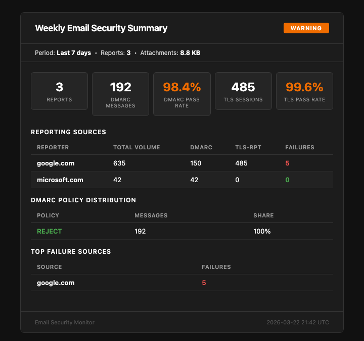

# EmailReports

[](https://github.com/mgieselman/EmailReports/actions/workflows/ci.yml)
[](https://github.com/mgieselman/EmailReports/actions/workflows/deploy.yml)
[](https://codecov.io/gh/mgieselman/EmailReports)
[](https://www.python.org/downloads/)
[](https://github.com/astral-sh/ruff)
[](https://opensource.org/licenses/MIT)

Low-cost Azure Function that processes DMARC aggregate (RUA) and TLS-RPT reports from a Microsoft 365 shared mailbox and sends alerts to Teams, email, and webhooks.



Built for **small organizations (<200 users)** that want automated email security monitoring without the cost of a commercial DMARC service. Runs on the Azure Functions **Flex Consumption** plan — effectively free for most tenants.

## Features

- **DMARC & TLS-RPT parsing** — handles .xml, .json, .gz, and .zip attachments from any reporting provider
- **Multi-channel alerts** — Teams (Adaptive Cards), email (HTML dashboard), and generic webhook (JSON POST for Slack/Discord/n8n)
- **Weekly summary digest** — configurable periodic email with top senders, pass rates, policy distribution, and failure sources
- **Report deduplication** — skips reports already processed (idempotent reruns)
- **Email lifecycle** — move processed messages to a folder, auto-delete after N days
- **Dark console dashboard emails** — dark theme, monospace IPs, color-coded PASS/FAIL, high-contrast stat cards

## How it works

1. Timer fires every 30 minutes (configurable)
2. Reads unread messages from a shared M365 mailbox via Microsoft Graph API
3. Routes messages by recipient alias (DMARC vs TLS-RPT)
4. Parses reports and calculates severity: **info** / **warning** / **critical**
5. Sends alerts, tracks report data in Table Storage
6. Sends a periodic summary email with aggregated stats

## Architecture

```
  Reporting MTAs          ┌─────────────────┐
  (Google, MSFT,          │  Shared Mailbox  │
   Yahoo, etc.)           │  emailreports@   │
        │                 └────────┬─────────┘
        │ DMARC/TLS-RPT           │ Microsoft Graph API
        ▼ reports via email        ▼
                           ┌──────────────┐
                           │ Azure Func   │ Timer: every 30 min
                           │ (Python 3.12)│ Summary: configurable
                           └──────┬───────┘
                                  │
                  ┌───────┬───────┼───────┬──────────┐
                  ▼       ▼       ▼       ▼          ▼
             ┌────────┐┌──────┐┌───────┐┌──────┐┌────────┐
             │ Teams  ││Email ││Webhook││Table ││Summary │
             │  Card  ││Alert ││(JSON) ││Store ││ Email  │
             └────────┘└──────┘└───────┘└──────┘└────────┘
```

## Quick Start

### Prerequisites

- Azure subscription (Flex Consumption plan)
- Microsoft 365 tenant
- Python 3.12+, Azure CLI (`az`)

### Setup

See the [Setup Guide](docs/setup.md) for step-by-step instructions covering:
1. Shared mailbox and DNS configuration
2. Entra ID app registration with scoped permissions
3. Azure resource deployment (Function App, Key Vault, Storage)
4. GitHub Actions deployment pipeline
5. Teams webhook configuration

### Local Development

```bash
cp local.settings.json.example local.settings.json
# Fill in your values

python3.12 -m venv .venv && source .venv/bin/activate
pip install -r requirements.txt

func start                                    # Run locally
pytest tests/ --cov --cov-report=term-missing # Run tests
python test_alert.py --email                  # Send test alert
```

## Configuration

See [Configuration Reference](docs/configuration.md) for all environment variables.

Key settings:

| Variable | Description |
|----------|-------------|
| `REPORT_MAILBOX` | Shared mailbox address |
| `DMARC_ALIAS` / `TLSRPT_ALIAS` | Aliases that receive reports |
| `TEAMS_WEBHOOK_URL` | Teams webhook (optional) |
| `ALERT_EMAIL_ENABLED` | Enable email alerts |
| `DELETE_AFTER_DAYS` | Delete read messages after N days (`0` = immediate, `-1` = never) |
| `SUMMARY_ENABLED` | Enable periodic summary email |
| `SUMMARY_SCHEDULE_CRON` | Summary schedule (default: Monday 9am UTC) |

## Monitoring

See [Monitoring Guide](docs/monitoring.md) for full details. Three layers:

1. **In-code** — CRITICAL alert to Teams/webhook on any exception (instant)
2. **Azure Monitor** — email alert if the function stops running (within 1 hour)
3. **Application Insights** — full logs, traces, exceptions (KQL queryable)

## Project Structure

```
├── function_app.py         # Timer triggers, orchestration
├── graph_client.py         # MSAL auth + Graph API
├── dmarc_parser.py         # DMARC RUA XML parsing
├── tlsrpt_parser.py        # TLS-RPT JSON parsing
├── attachment_util.py      # Shared decompression (gz/zip)
├── alert.py                # ViewModel — severity logic, data aggregation
├── delivery.py             # Delivery — Teams, email, generic webhook
├── storage.py              # Table Storage for report tracking + deduplication
├── models.py               # Dataclasses and enums
├── templates/              # Jinja2 HTML templates (View layer)
│   ├── base.html           # Dashboard layout (header, cards, footer)
│   ├── macros.html         # Reusable macros (th/td, badges, styled text)
│   ├── dmarc_alert.html
│   ├── tlsrpt_alert.html
│   └── weekly_summary.html
├── tests/                  # 235 tests, 100% coverage
├── .github/workflows/      # CI (lint+test+gitleaks) + deploy
└── docs/                   # Setup, config, and monitoring guides
```

## Contributing

See [CONTRIBUTING.md](CONTRIBUTING.md). Coverage must stay at 100%.

## License

MIT
